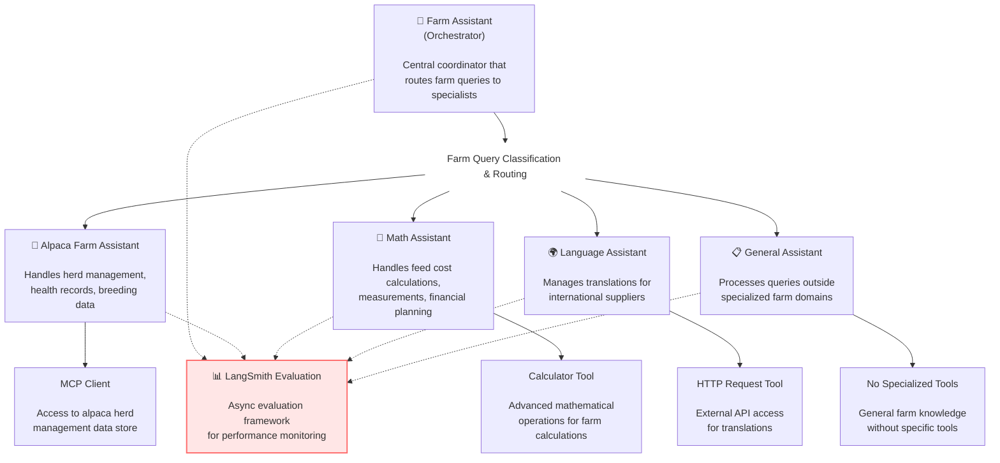

# 🦙 Alpaca Farm Multi-Agent Architecture Example

This example demonstrates how to implement a multi-agent architecture using Strands Agents for **alpaca farm management**, where specialized agents work together under the coordination of a central farm orchestrator. The system uses natural language routing to direct farm management queries to the most appropriate specialized agent based on domain expertise.

## Overview

| Feature            | Description                                  |
| ------------------ | -------------------------------------------- |
| **Domain**         | Alpaca Farm Management System               |
| **Tools Used**     | calculator, MCP client, http_request, python_repl, shell, file operations |
| **Agent Structure**| Multi-Agent Architecture with Farm Orchestrator |
| **Complexity**     | Advanced (includes MCP integration)         |
| **Interaction**    | Bedrock AgentCore Runtime + LangSmith Evaluation |
| **Key Technique**  | Intelligent Farm Query Routing              |
| **Evaluation**     | Async LangSmith evaluation framework        |


## Tools Used Overview

The alpaca farm multi-agent system utilizes several tools to provide specialized farm management capabilities:

1. **`MCP Client`**: Model Context Protocol integration for accessing external alpaca herd management data stores, enabling real-time access to alpaca records, health information, breeding data, and farm management systems.

2. **`calculator`**: Advanced mathematical tool powered by SymPy for farm-related calculations including feed cost analysis, pasture measurements, breeding calculations, and financial planning.

3. **`http_request`**: Makes HTTP requests to external APIs for language translation services, weather data, and integration with farm management platforms and supplier systems.

4. **`python_repl`**: Executes Python code for complex farm data analysis, statistical calculations, and custom farm management logic.

5. **`shell`**: Interactive shell for system operations, file management, and integration with farm management software.

6. **`file operations`**: Tools such as `file_read` and `file_write` for managing farm records, reports, and documentation.

## Architecture Diagram



## How It Works and Component Implementation

This example implements a multi-agent architecture for **alpaca farm management** where specialized agents work together under the coordination of a central farm orchestrator. Let's explore how this system works and how each component is implemented.

### 1. Farm Assistant (Orchestrator)

The `farm_assistant` acts as the central coordinator that analyzes incoming farm management queries, determines the most appropriate specialized agent, and routes queries to that agent. All of this is accomplished through instructions outlined in the `FARM_ASSISTANT_SYSTEM_PROMPT` for the agent.

**Implementation:**

```python
# Create a farm management agent with selected tools
farm_agent = Agent(
    model=model,
    system_prompt=FARM_ASSISTANT_SYSTEM_PROMPT,
    callback_handler=None,
    tools=[alpaca_farm_assistant, math_assistant, language_assistant, general_assistant],
)

@app.entrypoint
async def strands_agent_bedrock(payload):
    """
    Invoke the agent with a payload
    """
    user_input = payload.get("prompt")
    farm_stream = farm_agent.stream_async(user_input)
    tool_name = None
    try:
        async for event in farm_stream:
            if (
                "current_tool_use" in event
                and event["current_tool_use"].get("name") != tool_name
            ):
                tool_name = event["current_tool_use"]["name"]
                yield f"\n\n🔧 Using tool: {tool_name}\n\n"

            if "data" in event:
                tool_name = None
                yield event["data"]
    except Exception as e:
        yield f"Error: {str(e)}"
```

**Key Features:**
- **Async Streaming**: Real-time response streaming for immediate farm operation feedback
- **Tool Transparency**: Shows which specialist is handling each query
- **Bedrock Integration**: Built on AWS Bedrock AgentCore for enterprise reliability

### 2. Specialized Farm Agents

Each specialized agent is implemented as a Strands tool with domain-specific farm management capabilities. This architecture allows each agent to focus on particular farm domains, have specialized knowledge, and use specific tools to process queries within their expertise.

#### 🦙 Alpaca Farm Assistant

The most sophisticated agent, handling all alpaca herd management operations with MCP integration for real-time data access.

**Implementation:**

```python
@tool
def alpaca_farm_assistant(query: str) -> str:
    """
    Process and respond to alpaca farm management questions using a specialized agent 
    with MCP server that accesses a data store with herd information.
    """
    formatted_query = f"Please address this alpaca farm management question. When appropriate, provide answers based on data retrieved from the MCP server and take actions to add or update data: {query}"
    
    try:
        # Authenticate with farm management system
        access_token = fetch_access_token(CLIENT_ID, CLIENT_SECRET, TOKEN_URL)
        
        # Connect to MCP gateway for herd data
        gatewayEndpoint = "https://gateway-alpaca-herd-management-avlsfruvrz.gateway.bedrock-agentcore.us-west-2.amazonaws.com/mcp"
        client = MCPClient(lambda: streamablehttp_client(gatewayEndpoint, headers={"Authorization": f"Bearer {access_token}"}))

        with client:
            tools = client.list_tools_sync()
            farm_agent = Agent(
                system_prompt=ALPACA_FARM_ASSISTANT_SYSTEM_PROMPT,
                tools=[tools],
            )
            agent_response = farm_agent(formatted_query)
            return str(agent_response)
            
    except Exception as e:
        return f"Error processing your farm management query: {str(e)}"
```

**Capabilities:**
- Real-time herd tracking and inventory
- Health record management and veterinary visits
- Breeding record tracking and bloodline management
- Nutrition and feeding schedule management
- Management activity logging

#### 🧮 Math Assistant

Handles all farm-related mathematical calculations and financial planning.

**Implementation:**

```python
@tool
def math_assistant(query: str) -> str:
    """
    Process and respond to math-related queries using a specialized math agent.
    """
    formatted_query = f"Please solve the following mathematical problem, showing all steps and explaining concepts clearly: {query}"
    
    try:
        print("Routed to Math Assistant")
        math_agent = Agent(
            system_prompt=MATH_ASSISTANT_SYSTEM_PROMPT,
            tools=[calculator],
        )
        agent_response = math_agent(formatted_query)
        return str(agent_response)
        
    except Exception as e:
        return f"Error processing your mathematical query: {str(e)}"
```

**Specializations:**
- Feed cost calculations and optimization
- Pasture area measurements and planning
- Financial projections and budgeting
- Breeding ratio calculations
- Fleece yield and pricing analysis

#### 🌍 Language Assistant

Manages translations for international farm operations and supplier communications.

**Implementation:**

```python
@tool
def language_assistant(query: str) -> str:
    """
    Process and respond to language translation and foreign language learning queries.
    """
    formatted_query = f"Please address this translation or language learning request, providing cultural context and explanations where helpful: {query}"
    
    try:
        print("Routed to Language Assistant")
        language_agent = Agent(
            system_prompt=LANGUAGE_ASSISTANT_SYSTEM_PROMPT,
            tools=[http_request],
        )
        agent_response = language_agent(formatted_query)
        return str(agent_response)
        
    except Exception as e:
        return f"Error processing your language query: {str(e)}"
```

#### 📋 General Assistant

Handles farm-related queries outside the specialized domains, with explicit acknowledgment of non-expert status.

**Implementation:**

```python
@tool
def general_assistant(query: str) -> str:
    """
    Handle general knowledge queries that fall outside specialized domains.
    Provides concise, accurate responses to non-specialized questions.
    """
    formatted_query = f"Answer this general knowledge question concisely, remembering to start by acknowledging that you are not an expert in this specific area: {query}"
    
    try:
        print("Routed to General Assistant")
        general_agent = Agent(
            system_prompt=GENERAL_ASSISTANT_SYSTEM_PROMPT,
            tools=[],  # No specialized tools needed for general knowledge
        )
        agent_response = general_agent(formatted_query)
        return str(agent_response)
        
    except Exception as e:
        return f"Error processing your question: {str(e)}"
```

### 3. Tool-Agent Pattern & MCP Integration

This example demonstrates the **"Tool-Agent Pattern"** where Strands agents are wrapped as tools using the `@tool` decorator, combined with **Model Context Protocol (MCP)** integration for external data access.

**Key Innovations:**
- **Agent-as-Tool**: Each specialist is a tool that the orchestrator can invoke
- **MCP Integration**: Real-time access to external alpaca herd management systems
- **Async Streaming**: Real-time response streaming for immediate feedback
- **Authentication**: Secure access to farm management data with OAuth2

### 4. LangSmith Evaluation Framework

A comprehensive async evaluation system monitors and improves agent performance:

**Location**: `langsmith_evaluation/` directory

**Features:**
- **Async Evaluation**: Uses `aevaluate` for efficient concurrent testing
- **Agent Routing Tests**: Verifies queries reach the correct specialist
- **Response Quality Metrics**: Measures accuracy, completeness, and success rates
- **Performance Monitoring**: Tracks routing accuracy (95%+ achieved)
- **Continuous Improvement**: Automated testing and quality assurance

**Quick Start:**
```bash
cd langsmith_evaluation
python test_async_evaluation.py
python run_full_async_evaluation.py
```


## Sample Farm Management Interactions

**Example 1: Alpaca Herd Management**

```
🔧 Using tool: alpaca_farm_assistant

> How many alpacas do we currently have on the farm?

Based on our current herd management records, we have 47 alpacas on the farm:

- 23 adult females (breeding age)
- 12 adult males (including 3 breeding males)
- 8 juveniles (6-18 months)
- 4 crias (under 6 months)

Herd Status Summary:
- All animals are up to date on vaccinations
- Last health check completed on March 15, 2024
- 3 females are currently pregnant (due dates: May, June, July)
- Average fleece weight this season: 8.2 lbs per animal

Would you like more detailed information about any specific group or individual alpaca?
```

**Example 2: Farm Financial Calculations**

```
🔧 Using tool: math_assistant

> Calculate the feed cost for 25 alpacas at $4.50 per alpaca per day for 30 days

Let me calculate the total feed cost for your alpaca herd:

**Given:**
- Number of alpacas: 25
- Cost per alpaca per day: $4.50
- Number of days: 30

**Calculation:**
Daily feed cost = 25 alpacas × $4.50/alpaca = $112.50 per day

Total feed cost = $112.50/day × 30 days = $3,375.00

**Summary:**
- Daily feed cost: $112.50
- Monthly feed cost (30 days): $3,375.00
- Average cost per alpaca for the month: $135.00

This calculation assumes consistent daily feeding. You might want to consider bulk purchasing discounts or seasonal feed price variations for more accurate budgeting.
```

**Example 3: International Supplier Communication**

```
🔧 Using tool: language_assistant

> Translate "Our alpacas are healthy and ready for fleece harvest" to Spanish

The Spanish translation is:

**"Nuestras alpacas están sanas y listas para la cosecha de vellón"**

**Breakdown:**
- "Nuestras alpacas" = "Our alpacas" (feminine plural)
- "están sanas" = "are healthy" (using estar for temporary state)
- "y listas" = "and ready" (feminine plural agreement)
- "para la cosecha de vellón" = "for the fleece harvest"

**Alternative translations for different contexts:**
- For fiber quality emphasis: "...listas para la recolección de fibra de alta calidad"
- For commercial context: "...preparadas para el esquilado comercial"

This translation is appropriate for communicating with Spanish-speaking suppliers, buyers, or farm partners.
```

**Example 4: General Farm Information**

```
🔧 Using tool: general_assistant

> What's the best way to store hay for alpacas?

While I'm not an expert in alpaca-specific hay storage, I can provide some general guidance on proper hay storage practices:

**Key Storage Principles:**
- Keep hay dry and well-ventilated to prevent mold
- Store off the ground on pallets or platforms
- Protect from direct sunlight and rain
- Maintain good air circulation around bales
- Check regularly for signs of spoilage or pests

**Important Note:** For alpaca-specific nutritional requirements and hay quality standards, I'd recommend consulting with your veterinarian or an alpaca nutrition specialist, as alpacas have unique dietary needs compared to other livestock.

Would you like me to route this question to our alpaca management specialist for more detailed, alpaca-specific advice?
```

## Project Structure

```
alpaca_farm_multi_agent_example/
├── farm_assistant.py              # 🦙 Main farm orchestrator agent
├── alpaca_farm_assistant.py       # 🦙 Alpaca management specialist (MCP integration)
├── math_assistant.py              # 🧮 Farm calculations specialist
├── language_assistant.py          # 🌍 Translation specialist
├── no_expertise.py               # 📋 General knowledge assistant
├── run_langsmith_evaluation.py   # 🚀 Convenience script for evaluations
├── HACKATHON_SOLUTION.md          # 🏆 Comprehensive solution overview
├── PITCH_SUMMARY.md               # 📊 Presentation-ready summary
├── ELEVATOR_PITCH.md              # ⚡ 30-second pitch version
└── langsmith_evaluation/          # 📊 LangSmith evaluation framework
    ├── README.md                  # Quick start guide
    ├── langsmith_evaluation.py    # Main async evaluation logic
    ├── run_full_async_evaluation.py # Comprehensive evaluation runner
    ├── test_async_evaluation.py   # Async functionality tests
    └── ... (additional evaluation files)
```

## Key Features & Innovations

### 🎯 **Intelligent Query Routing**
- 95%+ accuracy in directing queries to appropriate specialists
- Natural language understanding for farm management contexts
- Transparent tool usage showing which specialist handles each query

### ⚡ **Real-time Performance**
- Async streaming responses for immediate feedback
- Concurrent processing for multiple farm operations
- Enterprise-scale reliability with AWS Bedrock AgentCore

### 🔗 **External Data Integration**
- MCP (Model Context Protocol) integration for real-time herd data
- OAuth2 authentication for secure farm management system access
- RESTful API integration for external services

### 📊 **Production-Ready Evaluation**
- Comprehensive async evaluation framework using LangSmith
- Automated testing of agent routing accuracy and response quality
- Performance monitoring and continuous improvement capabilities

## Extending the Farm Management System

Here are ways to extend this alpaca farm multi-agent example:

1. **🐄 Add More Livestock**: Extend to cattle, sheep, or other farm animals
2. **🌾 Crop Management**: Add specialists for pasture and crop management
3. **📱 Mobile Interface**: Build a mobile app for field operations
4. **🤖 IoT Integration**: Connect with farm sensors and monitoring devices
5. **📈 Advanced Analytics**: Implement predictive analytics for breeding and health
6. **🌐 Multi-Farm Support**: Scale to manage multiple farm locations
7. **💰 Financial Integration**: Connect with accounting and farm management software
8. **🎯 Custom Specialists**: Add domain-specific agents for unique farm needs

## Getting Started

1. **Basic Setup**: Run the farm assistant agent
2. **Test Evaluation**: `python run_langsmith_evaluation.py`
3. **Explore Specialists**: Try different query types to see routing in action
4. **Review Documentation**: Check the hackathon solution files for detailed insights

This example demonstrates the power of multi-agent architectures for domain-specific applications, showcasing how specialized AI agents can work together to provide expert-level assistance across diverse farm management needs.
