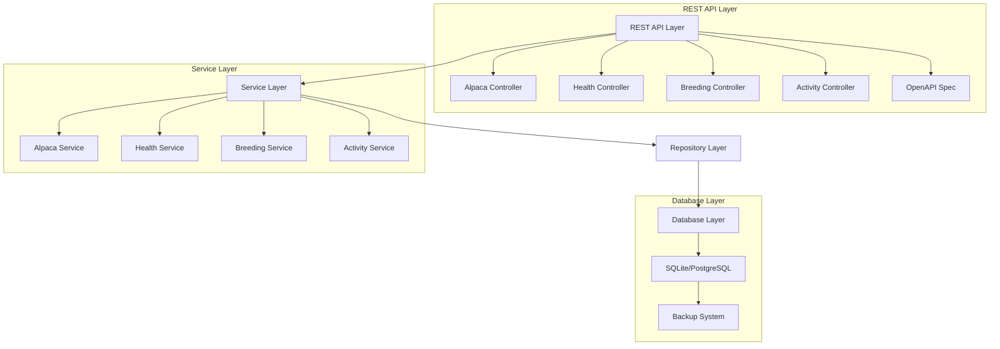

# Design Document

## Overview

The alpaca herd management system is implemented as a production-ready REST API with PostgreSQL RDS backend. The system provides comprehensive CRUD operations for all herd management entities through a clean, layered architecture. The implementation emphasizes data integrity, performance, and scalability using AWS RDS PostgreSQL with proper connection pooling, SSL encryption, and transaction management.

## Architecture

The storage system follows a layered architecture pattern with REST API interface:



### Database Implementation

- **Production Database**: AWS RDS PostgreSQL with SSL encryption
- **Connection Management**: PostgreSQL connection pooling with retry logic
- **Data Integrity**: Foreign key constraints and referential integrity enforcement
- **Performance**: Optimized queries with proper indexing and pagination
- **Scalability**: Supports concurrent access and transaction management

## Components and Interfaces

### Core Data Models

#### Alpaca Entity
```typescript
interface Alpaca {
  id: string;
  name: string;
  registrationNumber?: string;
  birthDate: Date;
  gender: 'male' | 'female';
  color: string;
  weight?: number;
  height?: number;
  fiberQuality?: FiberQuality;
  sireId?: string;
  damId?: string;
  createdAt: Date;
  updatedAt: Date;
}

interface FiberQuality {
  micronCount?: number;
  stapleLength?: number;
  crimp?: string;
  density?: string;
}
```

#### Health Record Entity
```typescript
interface HealthRecord {
  id: string;
  alpacaId: string;
  recordType: 'vaccination' | 'treatment' | 'observation' | 'checkup';
  date: Date;
  description: string;
  veterinarian?: string;
  nextDueDate?: Date;
  notes?: string;
  createdAt: Date;
}
```

#### Breeding Record Entity
```typescript
interface BreedingRecord {
  id: string;
  sireId: string;
  damId: string;
  breedingDate: Date;
  expectedDueDate?: Date;
  actualBirthDate?: Date;
  offspringIds: string[];
  notes?: string;
  createdAt: Date;
}
```

#### Management Activity Entity
```typescript
interface ManagementActivity {
  id: string;
  activityType: 'feeding' | 'shearing' | 'weighing' | 'moving' | 'training' | 'other';
  date: Date;
  alpacaIds: string[];
  performedBy: string;
  description: string;
  notes?: string;
  createdAt: Date;
}
```

### Repository Interfaces

#### Base Repository
```typescript
interface BaseRepository<T> {
  create(entity: Omit<T, 'id' | 'createdAt' | 'updatedAt'>): Promise<T>;
  findById(id: string): Promise<T | null>;
  findAll(options?: QueryOptions): Promise<T[]>;
  update(id: string, updates: Partial<T>): Promise<T>;
  delete(id: string): Promise<boolean>;
}

interface QueryOptions {
  limit?: number;
  offset?: number;
  sortBy?: string;
  sortOrder?: 'asc' | 'desc';
  filters?: Record<string, any>;
}
```

#### Specialized Repositories
```typescript
interface AlpacaRepository extends BaseRepository<Alpaca> {
  findByRegistrationNumber(regNumber: string): Promise<Alpaca | null>;
  findByParent(parentId: string): Promise<Alpaca[]>;
  findByGender(gender: 'male' | 'female'): Promise<Alpaca[]>;
  getLineage(alpacaId: string, generations: number): Promise<LineageTree>;
}

interface HealthRepository extends BaseRepository<HealthRecord> {
  findByAlpaca(alpacaId: string): Promise<HealthRecord[]>;
  findByDateRange(startDate: Date, endDate: Date): Promise<HealthRecord[]>;
  findOverdueVaccinations(): Promise<HealthRecord[]>;
  findByRecordType(type: string): Promise<HealthRecord[]>;
}

interface BreedingRepository extends BaseRepository<BreedingRecord> {
  findByParent(parentId: string): Promise<BreedingRecord[]>;
  findByDateRange(startDate: Date, endDate: Date): Promise<BreedingRecord[]>;
  checkInbreeding(sireId: string, damId: string): Promise<boolean>;
}

interface ActivityRepository extends BaseRepository<ManagementActivity> {
  findByAlpaca(alpacaId: string): Promise<ManagementActivity[]>;
  findByDateRange(startDate: Date, endDate: Date): Promise<ManagementActivity[]>;
  findByActivityType(type: string): Promise<ManagementActivity[]>;
  findByPerformer(performer: string): Promise<ManagementActivity[]>;
}
```

## REST API Design

### API Architecture

The REST API follows OpenAPI 3.0 specification and implements RESTful principles with proper HTTP methods, status codes, and resource-based URLs. The API provides comprehensive CRUD operations for all entities with additional specialized endpoints for complex queries.

### API Endpoints

#### Alpaca Management (Implemented)
```
GET    /api/v1/alpacas                    # List all alpacas with pagination
POST   /api/v1/alpacas                    # Create new alpaca
GET    /api/v1/alpacas/{id}               # Get alpaca by ID
PUT    /api/v1/alpacas/{id}               # Update alpaca
DELETE /api/v1/alpacas/{id}               # Delete alpaca
GET    /api/v1/alpacas/search             # Search alpacas by criteria
GET    /api/v1/alpacas/statistics         # Get herd statistics
GET    /api/v1/alpacas/gender/{gender}    # Filter alpacas by gender
```

#### Health Records Management (Implemented)
```
GET    /api/v1/health-records             # List health records with pagination
POST   /api/v1/health-records             # Create new health record
GET    /api/v1/health-records/{id}        # Get health record by ID
PUT    /api/v1/health-records/{id}        # Update health record
DELETE /api/v1/health-records/{id}        # Delete health record
GET    /api/v1/health-records/alpaca/{id} # Get health records for alpaca
GET    /api/v1/health-records/overdue-vaccinations # Get overdue vaccinations
GET    /api/v1/health-records/alerts      # Get health alerts
GET    /api/v1/health-records/type/{type} # Filter by record type
GET    /api/v1/health-records/summary/{id} # Get health summary for alpaca
```

#### Breeding Management (Implemented)
```
GET    /api/v1/breeding-records           # List breeding records with pagination
POST   /api/v1/breeding-records           # Create new breeding record
GET    /api/v1/breeding-records/{id}      # Get breeding record by ID
PUT    /api/v1/breeding-records/{id}      # Update breeding record
DELETE /api/v1/breeding-records/{id}      # Delete breeding record
GET    /api/v1/breeding-records/sire/{id} # Get records by sire
GET    /api/v1/breeding-records/dam/{id}  # Get records by dam
GET    /api/v1/breeding-records/parent/{id} # Get records by either parent
GET    /api/v1/breeding-records/expected-births # Get expected births
GET    /api/v1/breeding-records/statistics # Get breeding statistics
GET    /api/v1/breeding-records/date-range # Filter by date range
POST   /api/v1/breeding-records/validate-pair # Validate breeding pair
```

#### Activity Management (Implemented)
```
GET    /api/v1/activities                 # List activities with pagination
POST   /api/v1/activities                 # Create new activity
GET    /api/v1/activities/{id}            # Get activity by ID
PUT    /api/v1/activities/{id}            # Update activity
DELETE /api/v1/activities/{id}            # Delete activity
GET    /api/v1/activities/alpaca/{id}     # Get activities for alpaca
GET    /api/v1/activities/type/{type}     # Filter by activity type
GET    /api/v1/activities/performer/{name} # Filter by performer
GET    /api/v1/activities/statistics      # Get activity statistics
GET    /api/v1/activities/summary/{id}    # Get alpaca activity summary
GET    /api/v1/activities/date-range      # Filter by date range
POST   /api/v1/activities/bulk            # Create bulk activities
GET    /api/v1/activities/scheduled       # Get scheduled activities
GET    /api/v1/activities/performance-metrics # Get performance metrics
```

### Request/Response Models

#### API Response Wrapper
```typescript
interface ApiResponse<T> {
  success: boolean;
  data?: T;
  error?: {
    code: string;
    message: string;
    details?: any;
  };
  pagination?: {
    page: number;
    limit: number;
    total: number;
    totalPages: number;
  };
}

interface PaginationQuery {
  page?: number;
  limit?: number;
  sortBy?: string;
  sortOrder?: 'asc' | 'desc';
}
```

#### Alpaca API Models
```typescript
interface CreateAlpacaRequest {
  name: string;
  registrationNumber?: string;
  birthDate: string; // ISO date string
  gender: 'male' | 'female';
  color: string;
  weight?: number;
  height?: number;
  fiberQuality?: FiberQuality;
  sireId?: string;
  damId?: string;
}

interface AlpacaSearchQuery extends PaginationQuery {
  name?: string;
  gender?: 'male' | 'female';
  color?: string;
  registrationNumber?: string;
  birthDateFrom?: string;
  birthDateTo?: string;
}

interface LineageResponse {
  alpaca: Alpaca;
  ancestors: {
    generation: number;
    alpacas: Alpaca[];
  }[];
  descendants: {
    generation: number;
    alpacas: Alpaca[];
  }[];
}
```

#### Health Record API Models
```typescript
interface CreateHealthRecordRequest {
  alpacaId: string;
  recordType: 'vaccination' | 'treatment' | 'observation' | 'checkup';
  date: string; // ISO date string
  description: string;
  veterinarian?: string;
  nextDueDate?: string; // ISO date string
  notes?: string;
}

interface HealthRecordQuery extends PaginationQuery {
  alpacaId?: string;
  recordType?: string;
  dateFrom?: string;
  dateTo?: string;
  veterinarian?: string;
}
```

#### Breeding API Models
```typescript
interface CreateBreedingRecordRequest {
  sireId: string;
  damId: string;
  breedingDate: string; // ISO date string
  expectedDueDate?: string; // ISO date string
  notes?: string;
}

interface BreedingCompatibilityRequest {
  sireId: string;
  damId: string;
}

interface BreedingCompatibilityResponse {
  compatible: boolean;
  reason?: string;
  relationshipDegree?: number;
}
```

#### Activity API Models
```typescript
interface CreateActivityRequest {
  activityType: 'feeding' | 'shearing' | 'weighing' | 'moving' | 'training' | 'other';
  date: string; // ISO date string
  alpacaIds: string[];
  performedBy: string;
  description: string;
  notes?: string;
}

interface BulkActivityRequest {
  activityType: string;
  date: string;
  alpacaIds: string[];
  performedBy: string;
  description: string;
  notes?: string;
}
```

### Controller Interfaces

```typescript
interface AlpacaController {
  listAlpacas(query: AlpacaSearchQuery): Promise<ApiResponse<Alpaca[]>>;
  createAlpaca(request: CreateAlpacaRequest): Promise<ApiResponse<Alpaca>>;
  getAlpaca(id: string): Promise<ApiResponse<Alpaca>>;
  updateAlpaca(id: string, updates: Partial<CreateAlpacaRequest>): Promise<ApiResponse<Alpaca>>;
  deleteAlpaca(id: string): Promise<ApiResponse<void>>;
  getLineage(id: string, generations?: number): Promise<ApiResponse<LineageResponse>>;
  getOffspring(id: string): Promise<ApiResponse<Alpaca[]>>;
}

interface HealthController {
  listHealthRecords(query: HealthRecordQuery): Promise<ApiResponse<HealthRecord[]>>;
  createHealthRecord(request: CreateHealthRecordRequest): Promise<ApiResponse<HealthRecord>>;
  getHealthRecord(id: string): Promise<ApiResponse<HealthRecord>>;
  updateHealthRecord(id: string, updates: Partial<CreateHealthRecordRequest>): Promise<ApiResponse<HealthRecord>>;
  deleteHealthRecord(id: string): Promise<ApiResponse<void>>;
  getAlpacaHealth(alpacaId: string): Promise<ApiResponse<HealthRecord[]>>;
  getOverdueVaccinations(): Promise<ApiResponse<HealthRecord[]>>;
}

interface BreedingController {
  listBreedingRecords(query: PaginationQuery): Promise<ApiResponse<BreedingRecord[]>>;
  createBreedingRecord(request: CreateBreedingRecordRequest): Promise<ApiResponse<BreedingRecord>>;
  getBreedingRecord(id: string): Promise<ApiResponse<BreedingRecord>>;
  updateBreedingRecord(id: string, updates: Partial<CreateBreedingRecordRequest>): Promise<ApiResponse<BreedingRecord>>;
  deleteBreedingRecord(id: string): Promise<ApiResponse<void>>;
  checkCompatibility(request: BreedingCompatibilityRequest): Promise<ApiResponse<BreedingCompatibilityResponse>>;
  getAlpacaBreeding(alpacaId: string): Promise<ApiResponse<BreedingRecord[]>>;
}

interface ActivityController {
  listActivities(query: PaginationQuery): Promise<ApiResponse<ManagementActivity[]>>;
  createActivity(request: CreateActivityRequest): Promise<ApiResponse<ManagementActivity>>;
  getActivity(id: string): Promise<ApiResponse<ManagementActivity>>;
  updateActivity(id: string, updates: Partial<CreateActivityRequest>): Promise<ApiResponse<ManagementActivity>>;
  deleteActivity(id: string): Promise<ApiResponse<void>>;
  getAlpacaActivities(alpacaId: string): Promise<ApiResponse<ManagementActivity[]>>;
  createBulkActivity(request: BulkActivityRequest): Promise<ApiResponse<ManagementActivity>>;
}
```

### HTTP Status Codes

- **200 OK**: Successful GET, PUT requests
- **201 Created**: Successful POST requests
- **204 No Content**: Successful DELETE requests
- **400 Bad Request**: Invalid request data or parameters
- **404 Not Found**: Resource not found
- **409 Conflict**: Resource conflict (e.g., duplicate registration number)
- **422 Unprocessable Entity**: Validation errors
- **500 Internal Server Error**: Server errors

### Error Handling

```typescript
interface ApiError {
  code: string;
  message: string;
  details?: {
    field?: string;
    value?: any;
    constraint?: string;
  };
}

// Common error codes
const ErrorCodes = {
  VALIDATION_ERROR: 'VALIDATION_ERROR',
  NOT_FOUND: 'NOT_FOUND',
  DUPLICATE_REGISTRATION: 'DUPLICATE_REGISTRATION',
  INVALID_RELATIONSHIP: 'INVALID_RELATIONSHIP',
  DATABASE_ERROR: 'DATABASE_ERROR',
  INBREEDING_DETECTED: 'INBREEDING_DETECTED'
} as const;
```

## Data Models

### Database Schema (PostgreSQL RDS)

```sql
-- Alpacas table with UUID primary keys
CREATE TABLE alpacas (
    id UUID PRIMARY KEY DEFAULT uuid_generate_v4(),
    name VARCHAR(255) NOT NULL,
    registration_number VARCHAR(100) UNIQUE,
    birth_date DATE NOT NULL,
    gender VARCHAR(10) CHECK (gender IN ('male', 'female')) NOT NULL,
    color VARCHAR(100) NOT NULL,
    weight DECIMAL(6,2),
    height DECIMAL(6,2),
    fiber_micron_count DECIMAL(4,1),
    fiber_staple_length DECIMAL(4,1),
    fiber_crimp VARCHAR(50),
    fiber_density VARCHAR(50),
    sire_id UUID REFERENCES alpacas(id),
    dam_id UUID REFERENCES alpacas(id),
    created_at TIMESTAMP WITH TIME ZONE DEFAULT CURRENT_TIMESTAMP,
    updated_at TIMESTAMP WITH TIME ZONE DEFAULT CURRENT_TIMESTAMP
);

-- Health records table
CREATE TABLE health_records (
    id UUID PRIMARY KEY DEFAULT uuid_generate_v4(),
    alpaca_id UUID NOT NULL REFERENCES alpacas(id) ON DELETE CASCADE,
    record_type VARCHAR(20) CHECK (record_type IN ('vaccination', 'checkup', 'treatment', 'medication', 'surgery', 'injury', 'illness', 'other')) NOT NULL,
    date DATE NOT NULL,
    description TEXT NOT NULL,
    veterinarian VARCHAR(255),
    next_due_date DATE,
    notes TEXT,
    created_at TIMESTAMP WITH TIME ZONE DEFAULT CURRENT_TIMESTAMP
);

-- Breeding records table
CREATE TABLE breeding_records (
    id UUID PRIMARY KEY DEFAULT uuid_generate_v4(),
    sire_id UUID NOT NULL REFERENCES alpacas(id),
    dam_id UUID NOT NULL REFERENCES alpacas(id),
    breeding_date DATE NOT NULL,
    expected_due_date DATE,
    actual_birth_date DATE,
    notes TEXT,
    created_at TIMESTAMP WITH TIME ZONE DEFAULT CURRENT_TIMESTAMP
);

-- Breeding offspring junction table
CREATE TABLE breeding_offspring (
    breeding_id UUID REFERENCES breeding_records(id) ON DELETE CASCADE,
    offspring_id UUID REFERENCES alpacas(id) ON DELETE CASCADE,
    PRIMARY KEY (breeding_id, offspring_id)
);

-- Management activities table
CREATE TABLE management_activities (
    id UUID PRIMARY KEY DEFAULT uuid_generate_v4(),
    activity_type VARCHAR(50) NOT NULL,
    date DATE NOT NULL,
    performed_by VARCHAR(255) NOT NULL,
    description TEXT NOT NULL,
    notes TEXT,
    created_at TIMESTAMP WITH TIME ZONE DEFAULT CURRENT_TIMESTAMP
);

-- Activity alpacas junction table
CREATE TABLE activity_alpacas (
    activity_id UUID REFERENCES management_activities(id) ON DELETE CASCADE,
    alpaca_id UUID REFERENCES alpacas(id) ON DELETE CASCADE,
    PRIMARY KEY (activity_id, alpaca_id)
);

-- Indexes for performance
CREATE INDEX idx_alpacas_registration ON alpacas(registration_number);
CREATE INDEX idx_alpacas_birth_date ON alpacas(birth_date);
CREATE INDEX idx_alpacas_parents ON alpacas(sire_id, dam_id);
CREATE INDEX idx_health_alpaca_date ON health_records(alpaca_id, date);
CREATE INDEX idx_health_due_date ON health_records(next_due_date);
CREATE INDEX idx_breeding_parents ON breeding_records(sire_id, dam_id);
CREATE INDEX idx_activities_date ON management_activities(date);
```

### Data Relationships

- **Alpacas**: Self-referencing for sire/dam relationships
- **Health Records**: Many-to-one with Alpacas
- **Breeding Records**: Many-to-many with Alpacas (sire, dam, offspring)
- **Management Activities**: Many-to-many with Alpacas

## Error Handling

### Database Connection Errors
- Implement connection pooling with retry logic
- Graceful degradation when database is unavailable
- Clear error messages for connection issues

### Data Validation Errors
- Comprehensive input validation at service layer
- Foreign key constraint handling
- Duplicate registration number prevention
- Date validation (birth dates, breeding dates)

### Backup and Recovery Errors
- Backup failure notifications
- Corruption detection and recovery procedures
- Rollback capabilities for failed operations

### REST API Error Handling
- Standardized error response format with error codes
- Input validation with detailed field-level error messages
- HTTP status code mapping for different error types
- Request/response logging for debugging
- Rate limiting and request size validation

### Performance Considerations
- Query timeout handling (5-second limit)
- Large dataset pagination
- Memory management for bulk operations
- API response caching for frequently accessed data
- Request compression and response optimization

## Testing Strategy

### Unit Testing
- Repository layer testing with in-memory database
- Service layer business logic validation
- Data model validation testing
- Error handling scenario testing

### Integration Testing
- Database schema migration testing
- Cross-entity relationship testing
- Backup and recovery procedure testing
- REST API endpoint testing with realistic data volumes

### API Testing
- OpenAPI specification validation
- Request/response schema validation
- HTTP status code verification
- Authentication and authorization testing
- API contract testing with generated clients

### Test Data Management
- Seed data for development and testing
- Anonymized production data for testing
- Automated test data cleanup


## Current Implementation Status

### Completed Features

#### Core API Endpoints
- **Alpacas**: Full CRUD with search, statistics, gender filtering
- **Health Records**: Full CRUD with alerts, overdue vaccinations, summaries  
- **Breeding Records**: Full CRUD with statistics, expected births, validation
- **Activities**: Full CRUD with bulk operations, performance metrics, scheduling

#### Database Integration
- **PostgreSQL RDS**: Production-ready with SSL encryption
- **Connection Pooling**: Efficient connection management with retry logic
- **Data Relationships**: Proper foreign key constraints and referential integrity
- **Transaction Support**: Atomic operations for complex data changes

#### API Features
- **RESTful Design**: Consistent HTTP methods and status codes
- **Pagination**: Configurable page size and offset-based pagination
- **Filtering**: Date ranges, entity types, and custom filters
- **Statistics**: Real-time analytics and reporting capabilities
- **Error Handling**: Standardized error responses with detailed messages

### Architecture Implementation

#### Repository Layer
- `PostgreSQLAlpacaRepository`: Alpaca data access with lineage queries
- `PostgreSQLHealthRepository`: Health records with overdue tracking
- `PostgreSQLBreedingRepository`: Breeding records with offspring management
- `PostgreSQLActivityRepository`: Activities with multi-alpaca associations

#### Service Layer  
- `AlpacaService`: Business logic for herd management
- `HealthService`: Medical record management and alerts
- `BreedingService`: Breeding program logic and statistics
- `ActivityService`: Management activity tracking and metrics

#### Controller Layer
- `AlpacaController`: REST endpoints for alpaca operations
- `HealthController`: Health record API with specialized queries
- `BreedingController`: Breeding management with validation
- `ActivityController`: Activity management with bulk operations

### Data Backup Strategy (AWS RDS)
- **Automated Backups**: AWS RDS automated backup with point-in-time recovery
- **Backup Retention**: Configurable retention period (7-35 days)
- **Cross-Region Replication**: Optional for disaster recovery
- **Snapshot Management**: Manual snapshots for major changes

