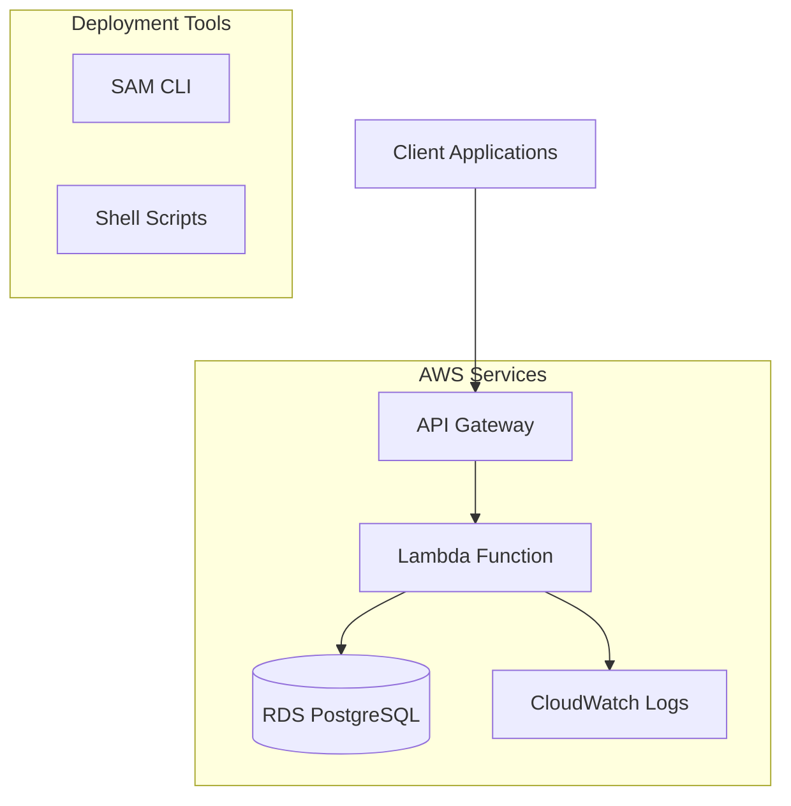

# AWS SAM Deployment Design Document

## Overview

This design outlines the conversion of the existing Express.js alpaca-farm-mgmt-storage API into a serverless architecture using AWS SAM (Serverless Application Model), API Gateway, and Lambda functions. The solution will maintain the same API endpoints and functionality while providing a cost-effective, scalable deployment suitable for POC usage.

The design focuses on simplicity and ease of debugging, with shell scripts for deployment management and comprehensive logging for troubleshooting.

## Architecture

### High-Level Architecture



### Lambda Function Strategy

**Single Lambda Function Approach**: Instead of creating multiple Lambda functions for each route, we'll use a single Lambda function that handles all API routes. This approach:
- Simplifies deployment and management
- Reduces cold start issues for low-traffic POC usage
- Maintains the existing Express.js routing structure
- Minimizes AWS resource complexity

### API Gateway Configuration

- **REST API**: Use REST API (not HTTP API) for full feature compatibility
- **Proxy Integration**: Configure `{proxy+}` to forward all requests to the Lambda function
- **CORS**: Enable CORS for cross-origin requests
- **Request/Response Mapping**: Minimal mapping, let Lambda handle request processing

## Components and Interfaces

### 1. SAM Template (`template.yaml`)

The SAM template will define:

```yaml
# Key components:
- Lambda Function with Express.js handler
- API Gateway with proxy integration
- IAM roles for RDS access
- Environment variables for database connection
- CloudWatch log groups
```

**Key Configuration**:
- **Runtime**: Node.js 18.x
- **Memory**: 512 MB (cost-effective for POC)
- **Timeout**: 30 seconds
- **Environment Variables**: Database connection parameters

### 2. Lambda Handler (`src/lambda/handler.ts`)

The Lambda handler will:
- Import the existing Express app
- Use `serverless-http` or similar adapter to convert Express to Lambda-compatible format
- Handle API Gateway event/response transformation
- Maintain existing middleware and routing

**Interface**:
```typescript
export const handler = async (event: APIGatewayProxyEvent): Promise<APIGatewayProxyResult>
```

### 3. Database Connection Adaptation

**Connection Pooling Strategy**:
- Modify existing connection manager for Lambda environment
- Implement connection reuse across Lambda invocations
- Add connection health checks and automatic reconnection
- Configure appropriate connection limits for Lambda concurrency

**Environment Variables**:
```bash
RDS_HOST=<rds-endpoint>
RDS_PORT=5432
RDS_DATABASE=alpaca_herd
RDS_USERNAME=<username>
RDS_PASSWORD=<password>
AWS_REGION=us-east-1
```

### 4. Deployment Scripts

#### `deploy.sh`
- Validates AWS credentials and region
- Builds TypeScript code
- Packages Lambda function
- Deploys SAM stack
- Outputs API Gateway endpoint URL

#### `destroy.sh`
- Removes SAM stack and all resources
- Confirms resource cleanup
- Provides cleanup verification

#### `status.sh`
- Shows deployment status
- Lists stack resources
- Displays API Gateway endpoint
- Shows recent CloudWatch logs

#### `logs.sh`
- Streams CloudWatch logs in real-time
- Filters logs by severity level
- Provides log search functionality

## Data Models

The existing data models remain unchanged:
- **Alpacas**: Core alpaca information and lineage
- **Health Records**: Medical records and scheduling
- **Breeding Records**: Breeding information and offspring tracking
- **Management Activities**: Farm management activities

**Database Schema**: No changes required - uses existing PostgreSQL schema and migrations.

## Error Handling

### Lambda-Specific Error Handling

1. **Cold Start Handling**:
   - Implement connection warming
   - Add cold start detection and logging
   - Optimize initialization time

2. **Database Connection Errors**:
   - Implement exponential backoff retry logic
   - Add connection pool monitoring
   - Handle connection timeouts gracefully

3. **API Gateway Integration Errors**:
   - Proper HTTP status code mapping
   - Error response formatting for API Gateway
   - Request/response size limit handling

### CloudWatch Logging Strategy

```typescript
// Structured logging for CloudWatch
const logger = {
  info: (message: string, meta?: object) => console.log(JSON.stringify({ level: 'info', message, ...meta })),
  error: (message: string, error?: Error, meta?: object) => console.error(JSON.stringify({ level: 'error', message, error: error?.message, stack: error?.stack, ...meta })),
  warn: (message: string, meta?: object) => console.warn(JSON.stringify({ level: 'warn', message, ...meta }))
};
```

## Testing Strategy

### Local Testing
- **SAM Local**: Use `sam local start-api` for local development
- **Docker**: Containerized local testing environment
- **Environment Parity**: Match Lambda environment locally

### Deployment Testing
- **Health Check Endpoint**: Verify basic functionality
- **Database Connectivity**: Test RDS connection
- **API Endpoint Testing**: Automated curl scripts for all endpoints
- **Load Testing**: Basic load testing for POC validation

### Testing Scripts

#### `test-local.sh`
- Starts SAM local API
- Runs health checks
- Tests all API endpoints locally

#### `test-deployed.sh`
- Tests deployed API Gateway endpoints
- Validates database connectivity
- Runs comprehensive API tests

## Deployment Configuration

### Environment-Specific Configuration

**Development/POC Configuration**:
```yaml
# SAM parameters
MemorySize: 512
Timeout: 30
ReservedConcurrency: 5  # Limit for cost control
Environment:
  Variables:
    NODE_ENV: production
    LOG_LEVEL: info
```

### Cost Optimization

1. **Lambda Configuration**:
   - Minimal memory allocation (512 MB)
   - Appropriate timeout settings (30s)
   - Reserved concurrency limits

2. **API Gateway**:
   - REST API (not premium features)
   - Basic request/response mapping
   - Standard caching disabled for POC

3. **CloudWatch**:
   - Standard log retention (7 days for POC)
   - Basic monitoring metrics

## Security Considerations

### IAM Roles and Policies

**Lambda Execution Role**:
```json
{
  "Version": "2012-10-17",
  "Statement": [
    {
      "Effect": "Allow",
      "Action": [
        "logs:CreateLogGroup",
        "logs:CreateLogStream",
        "logs:PutLogEvents"
      ],
      "Resource": "arn:aws:logs:*:*:*"
    },
    {
      "Effect": "Allow",
      "Action": [
        "rds-db:connect"
      ],
      "Resource": "arn:aws:rds-db:*:*:dbuser:*/lambda-user"
    }
  ]
}
```

### Network Security
- **VPC Configuration**: Optional for POC, can connect to RDS directly
- **Security Groups**: Minimal required access
- **SSL/TLS**: Enforce HTTPS for API Gateway

### Database Security
- **Connection Encryption**: SSL/TLS for RDS connections
- **Credential Management**: Environment variables (can upgrade to Secrets Manager later)
- **Connection Limits**: Appropriate pool sizing for Lambda

## Monitoring and Debugging

### CloudWatch Integration

1. **Metrics**:
   - Lambda duration and error rates
   - API Gateway request counts and latency
   - Database connection metrics

2. **Logs**:
   - Structured JSON logging
   - Request/response logging
   - Error stack traces
   - Database query logging (debug mode)

3. **Alarms**:
   - High error rates
   - Long response times
   - Database connection failures

### Debugging Tools

#### `debug.sh`
- Tails CloudWatch logs in real-time
- Filters by error level
- Provides log search and analysis

#### `metrics.sh`
- Shows Lambda performance metrics
- Displays API Gateway statistics
- Reports database connection health

## Migration Strategy

### Phase 1: Basic Lambda Conversion
1. Create Lambda handler wrapper around existing Express app
2. Configure basic SAM template
3. Set up database connection for Lambda environment
4. Deploy and test basic functionality

### Phase 2: Optimization and Tooling
1. Implement comprehensive error handling
2. Add CloudWatch logging and monitoring
3. Create deployment and management scripts
4. Add debugging and testing tools

### Phase 3: Production Readiness
1. Security hardening
2. Performance optimization
3. Cost optimization
4. Documentation and runbooks

## File Structure

```
alpaca-farm-mgmt-storage/
├── template.yaml                 # SAM template
├── src/
│   └── lambda/
│       ├── handler.ts           # Lambda entry point
│       ├── app-adapter.ts       # Express to Lambda adapter
│       └── connection-manager.ts # Lambda-optimized DB connections
├── scripts/
│   ├── deploy.sh               # Deployment script
│   ├── destroy.sh              # Cleanup script
│   ├── status.sh               # Status checking
│   ├── logs.sh                 # Log viewing
│   ├── debug.sh                # Debugging tools
│   ├── test-local.sh           # Local testing
│   └── test-deployed.sh        # Deployed API testing
├── config/
│   ├── samconfig.toml          # SAM configuration
│   └── deployment-config.json   # Deployment parameters
└── docs/
    ├── deployment-guide.md      # Deployment instructions
    ├── debugging-guide.md       # Debugging guide
    └── api-examples.md          # API usage examples
```

This design provides a comprehensive, simple, and cost-effective solution for deploying the alpaca-farm-mgmt-storage API to AWS using SAM and Lambda, with excellent debugging capabilities and easy management through shell scripts.