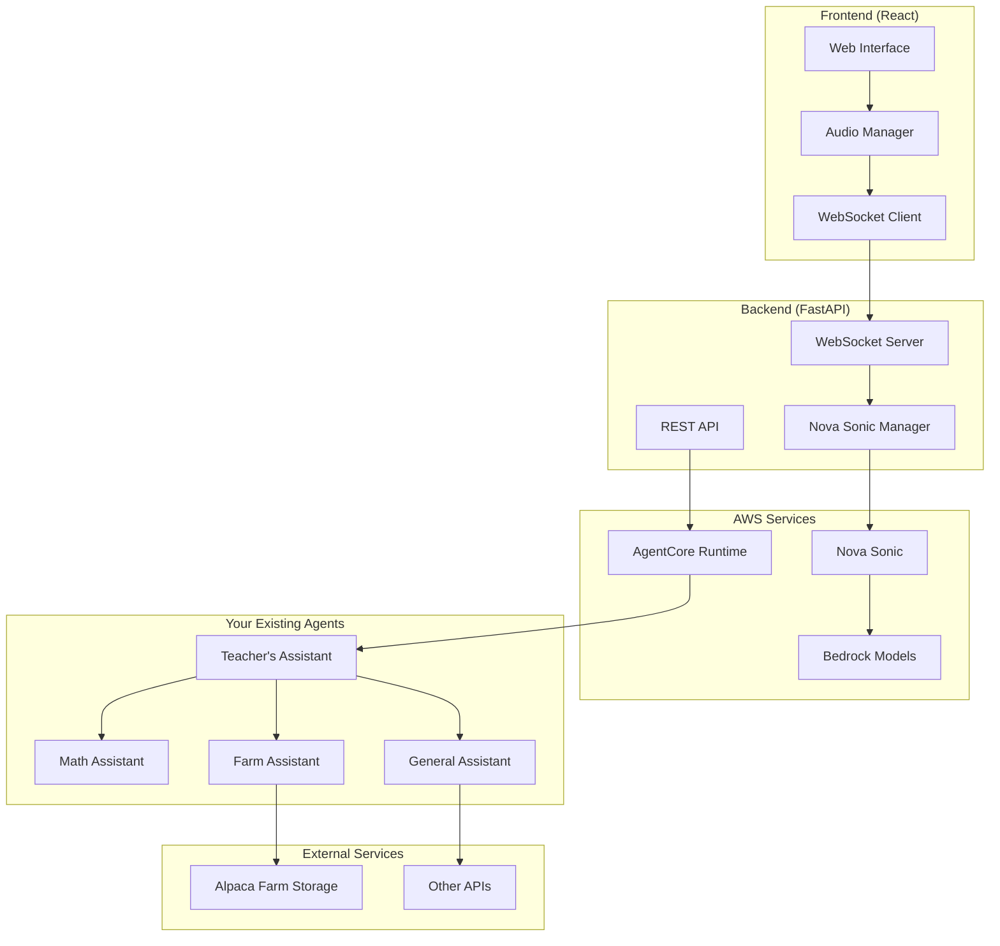

# Nova Sonic Web App Integration Guide

## Overview

The Nova Sonic Web App provides a modern web interface for speech-to-speech AI interactions using Amazon Nova Sonic. It integrates seamlessly with your existing AgentCore multi-agent showcase, allowing users to talk directly to their APIs and agents using natural voice conversation.

## Architecture



## Key Features

### 🎙️ **Speech-to-Speech Interface**
- **Real-time Audio Processing**: Capture microphone input and convert to streaming audio
- **Nova Sonic Integration**: Direct integration with Amazon Nova Sonic for natural speech synthesis
- **Voice Selection**: Multiple voice options (Matthew, Olivia, Ruth, Stephen)
- **Audio Visualization**: Real-time audio level indicators and visual feedback

### 🤖 **AgentCore Integration**
- **Agent Discovery**: Automatically detect and list available AgentCore agents
- **Multi-Region Support**: Connect to agents across different AWS regions
- **Version Management**: Select specific agent versions for interaction
- **Session Management**: Maintain conversation context across interactions

### 🛠️ **Enhanced Tool System**
The web app extends the original Nova Sonic tools with additional capabilities:

#### **Original Nova Sonic Tools**
- **Date/Time Tool**: Get current date and time information
- **Order Tracking Tool**: Track orders with realistic simulation

#### **Extended AgentCore Tools**
- **AgentCore Assistant**: Direct integration with your deployed agents
- **Alpaca Farm Management**: Access livestock data and farm operations
- **Multi-Agent Orchestration**: Route complex queries to specialized agents

### 🌐 **Modern Web Interface**
- **Responsive Design**: Works on desktop, tablet, and mobile devices  
- **Dark Theme**: Professional dark theme with glass morphism effects
- **Real-time Feedback**: Live transcripts, tool usage visualization, and status indicators
- **Accessibility**: Full keyboard navigation and screen reader support

## Installation

### Prerequisites
- Python 3.11+
- Node.js 18+
- AWS CLI configured
- Access to Amazon Bedrock Nova Sonic

### Quick Setup
```bash
# Navigate to the Nova Sonic web app directory
cd nova-sonic-web-app

# Run the automated setup
./setup.sh

# Configure AWS credentials
aws configure

# Start the application
./start-app.sh
```

### Manual Setup
If you prefer manual setup:

```bash
# Backend setup
cd backend
uv venv
uv sync --all-groups

# Frontend setup
cd ../frontend
npm install

# Start backend (terminal 1)
cd backend
source .venv/bin/activate
uv run uvicorn main:app --reload

# Start frontend (terminal 2)  
cd frontend
npm start
```

## Configuration

### Environment Variables

#### Backend Configuration (`backend/.env`)
```bash
# AWS Configuration
AWS_ACCESS_KEY_ID=your-access-key
AWS_SECRET_ACCESS_KEY=your-secret-key
AWS_DEFAULT_REGION=us-east-1

# Nova Sonic Settings
NOVA_SONIC_MODEL_ID=amazon.nova-sonic-v1:0
NOVA_SONIC_VOICE_ID=matthew

# Server Settings
HOST=0.0.0.0
PORT=8000
DEBUG=false
```

#### Frontend Configuration (`frontend/.env`)
```bash
# API URLs (for production deployment)
REACT_APP_API_URL=http://localhost:8000
REACT_APP_WS_URL=ws://localhost:8000

# Feature flags
REACT_APP_ENABLE_DEBUG=false
```

### AWS Permissions
Your AWS credentials need these permissions:

```json
{
    "Version": "2012-10-17", 
    "Statement": [
        {
            "Effect": "Allow",
            "Action": [
                "bedrock:InvokeModel",
                "bedrock-agentcore-control:ListAgentRuntimes",
                "bedrock-agentcore-control:ListAgentRuntimeVersions", 
                "bedrock-agentcore:InvokeAgentRuntime"
            ],
            "Resource": "*"
        }
    ]
}
```

## Usage

### Basic Workflow
1. **Start the Application**: Run `./start-app.sh`
2. **Open Browser**: Navigate to `http://localhost:3000`
3. **Configure Agent**: Click settings and select an AgentCore agent (optional)
4. **Start Session**: Click the green phone button
5. **Speak**: Click the microphone button and speak your query
6. **Listen**: Receive AI responses via speech and see transcripts
7. **End Session**: Click the red phone button when done

### Advanced Features

#### **Agent Selection**
- Browse available agents from your AWS account
- Filter by region and version
- View agent descriptions and status

#### **Voice Customization**
- Choose from multiple voice options
- Adjust voice settings for different use cases
- Test voice output before starting sessions

#### **Tool Interaction**
- Watch real-time tool execution
- View detailed tool results
- Monitor API calls and data retrieval

#### **Transcript Management**
- View complete conversation history
- Export transcripts for later review
- Clear history between sessions

## Integration with Existing Agents

### Connecting Your AgentCore Agents

The Nova Sonic web app automatically discovers and connects to your existing AgentCore agents. Here's how it integrates:

#### **Teacher's Assistant Integration**
```python
# Your existing teacher's assistant becomes accessible via speech
agent_arn = "arn:aws:bedrock-agentcore:us-east-1:123456789012:agent/teacher-assistant"

# Users can now say: "Solve the quadratic equation x^2 + 5x + 6 = 0"
# And hear the math assistant's response via Nova Sonic
```

#### **Multi-Agent Orchestration**
The web app preserves your existing multi-agent architecture:
- **Speech Input** → Nova Sonic → **Teacher's Assistant** → **Specialized Agent** → **Response** → Nova Sonic → **Speech Output**

#### **Tool Enhancement**
Your existing tools are enhanced with speech capabilities:

```python
# Before: Text-only interaction
result = math_assistant("Solve for x: 2x + 5 = 15")

# After: Speech-to-speech interaction
# User speaks: "Solve for x: 2x + 5 = 15"  
# Agent responds with speech: "To solve 2x + 5 = 15, first subtract 5..."
```

### Custom Tool Integration

Add your own tools to the Nova Sonic interface:

```python
# In tool_extensions.py
@tool
def custom_api_tool(query: str) -> Dict:
    """Your custom tool description"""
    # Your tool logic here
    return {"result": "Your custom response"}

# Register in get_tool_specifications()
tools.append({
    "toolSpec": {
        "name": "customApiTool",
        "description": "Your tool description for Nova Sonic",
        "inputSchema": {
            "json": json.dumps({
                "type": "object",
                "properties": {
                    "query": {"type": "string", "description": "User query"}
                },
                "required": ["query"]
            })
        }
    }
})
```

## API Reference

### WebSocket Messages

#### Client to Server
```javascript
// Start session
{
    "type": "start_session",
    "agent_arn": "arn:aws:bedrock-agentcore:...",
    "voice_id": "matthew", 
    "tools_enabled": true
}

// Send audio chunk
{
    "type": "audio_chunk",
    "audio_data": "base64-encoded-pcm-data"
}

// End audio input
{
    "type": "end_audio"
}

// Stop session
{
    "type": "stop_session"
}
```

#### Server to Client
```javascript
// Session started
{
    "type": "session_started",
    "session_id": "uuid",
    "voice_id": "matthew",
    "tools_enabled": true
}

// Transcript update
{
    "type": "transcript", 
    "content": "transcribed text",
    "role": "user|assistant"
}

// Audio output
{
    "type": "audio_output",
    "audio_data": "base64-encoded-pcm-data"
}

// Tool usage
{
    "type": "tool_use_started",
    "tool_name": "mathAssistant",
    "tool_id": "uuid"
}

// Tool result
{
    "type": "tool_result",
    "tool_name": "mathAssistant", 
    "result": {"solution": "x = 5"}
}
```

### REST API Endpoints

#### **GET /api/agents**
List available AgentCore agents
```bash
curl "http://localhost:8000/api/agents?region=us-east-1"
```

#### **GET /api/agents/{agent_id}/versions**
List versions for a specific agent
```bash
curl "http://localhost:8000/api/agents/agent-123/versions?region=us-east-1"
```

#### **GET /health**
Health check endpoint
```bash
curl "http://localhost:8000/health"
```

## Troubleshooting

### Common Issues

#### **Microphone Access Denied**
- **Cause**: Browser security settings
- **Solution**: Grant microphone permissions in browser settings
- **Chrome**: Click the microphone icon in the address bar
- **Firefox**: Go to Preferences > Privacy & Security > Permissions

#### **No Audio Output**
- **Cause**: Browser compatibility or audio context issues
- **Solution**: 
  - Try a different browser (Chrome recommended)
  - Check browser audio settings
  - Ensure speakers/headphones are working

#### **No Agents Found**
- **Cause**: No deployed agents or incorrect AWS configuration
- **Solution**:
  - Deploy agents using the existing AgentCore setup
  - Verify AWS credentials and region settings
  - Check IAM permissions for AgentCore access

#### **Connection Errors**
- **Cause**: Network issues or AWS credential problems
- **Solution**:
  - Check internet connectivity
  - Verify AWS credentials with `aws sts get-caller-identity`
  - Ensure Nova Sonic access in your AWS region

### Debug Mode

Enable debug logging:
```bash
# Backend
export DEBUG=true
uv run uvicorn main:app --reload --log-level debug

# Frontend  
export REACT_APP_ENABLE_DEBUG=true
npm start
```

### Performance Optimization

#### **Audio Latency**
- Use Chrome for best WebRTC performance
- Ensure stable internet connection
- Consider adjusting audio chunk sizes in AudioManager.js

#### **Tool Response Time**
- Deploy agents in same region as Nova Sonic
- Optimize tool implementations for speed
- Use caching for frequently accessed data

## Deployment

### Development
```bash
./start-app.sh
```

### Production

#### **Backend Deployment**
```bash
# Using Docker
docker build -t nova-sonic-backend ./backend
docker run -p 8000:8000 nova-sonic-backend

# Using systemd service
sudo cp nova-sonic.service /etc/systemd/system/
sudo systemctl enable nova-sonic
sudo systemctl start nova-sonic
```

#### **Frontend Deployment**
```bash
# Build for production
cd frontend
npm run build

# Serve with nginx or Apache
sudo cp -r build/* /var/www/html/
```

#### **AWS Deployment**
- Use AWS App Runner for backend
- Use AWS Amplify for frontend
- Configure environment variables in AWS console

## Security Considerations

### **Audio Data**
- Audio is processed in real-time and not stored
- WebSocket connections use secure protocols in production
- Implement rate limiting for API endpoints

### **AWS Credentials**
- Use IAM roles instead of access keys when possible
- Implement least privilege access policies
- Rotate credentials regularly

### **CORS Configuration**
- Configure allowed origins in production
- Use HTTPS for all production deployments
- Implement proper authentication if needed

## Contributing

### Development Setup
1. Fork the repository
2. Follow the installation guide
3. Make your changes
4. Test with existing agents
5. Submit a pull request

### Adding New Features
- **New Tools**: Add to `tool_extensions.py`
- **UI Components**: Add to `frontend/src/components/`
- **Backend APIs**: Add to `main.py` or separate modules

### Testing
```bash
# Backend tests
cd backend && uv run pytest

# Frontend tests  
cd frontend && npm test

# Integration tests
./scripts/test-integration.sh
```

## Support

For issues and questions:
1. Check this integration guide
2. Review the troubleshooting section
3. Open an issue in the repository
4. Check AWS Bedrock documentation for service-specific issues

## License

This integration follows the same license as the main AgentCore showcase project.

---

**🚀 Happy building with Nova Sonic and AgentCore!**